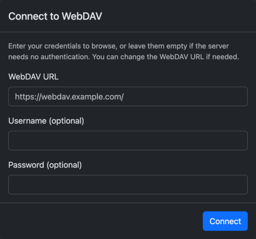

# WebDAV Index

README [English](README.md) | [中文](README_ZH.md)

## What is this

A local-first WebDAV client that browses remote files as a read-only list.

Everything runs in the browser, so your personal data stays within reach from any device, at any time.

### Features

- [x] **List View**: files are laid out in a table showing the file name, last modified time, and size
- [x] **Authentication**: optional HTTP Basic authentication
- [x] **Persistent Credentials**: the username and password can be saved to `localStorage`
- [x] **Connection Switching**: switch between saved connections without re-entering credentials
- [x] **Mobile Friendly**: responsive layout

## Download and Install

Nothing to download or install — just open [https://fantasticmao.github.io/webdav-index/](https://fantasticmao.github.io/webdav-index/) in your browser.

## Quick Start

Enter the URL of your WebDAV service, along with a username and password if the service requires them, then click Connect.

> **Note**: Your WebDAV service must have Cross-Origin Resource Sharing (CORS) enabled. At a minimum, it has to allow the `OPTIONS`, `PROPFIND`, and `GET` methods, and the `Authorization` and `Depth` request headers.

WebDAV-Index lists remote directories and opens files straight from the browser, with no backend and no build step. Browsing is read-only: editing, uploading, and deleting files are out of scope. Whether a file such as `.mp4`, `.jpg`, or `.txt` can be previewed depends on the capabilities of the browser and on the content type the server returns.

## How it works

WebDAV-Index is built on the following major dependencies:

- [webdav-client](https://github.com/perry-mitchell/webdav-client): sends the WebDAV requests — directory listings and metadata — directly from the browser.
- [localStorage](https://developer.mozilla.org/en-US/docs/Web/API/Window/localStorage): keeps connection details and credentials on the local machine for quick access and host switching.
- [Bootstrap](https://getbootstrap.com/): supplies the UI components, grid, and responsive styles.
- [Alpine.js](https://alpinejs.dev/): manages UI state and user interactions declaratively.

## Frequently Asked Questions

## License

WebDAV-Index [License](https://github.com/fantasticmao/webdav-index/blob/main/LICENSE)

Copyright (c) 2026 fantasticmao
