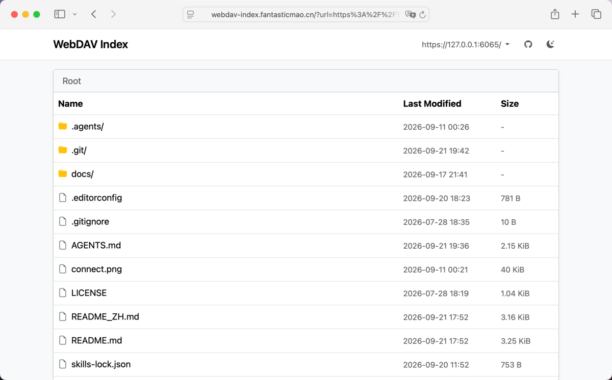
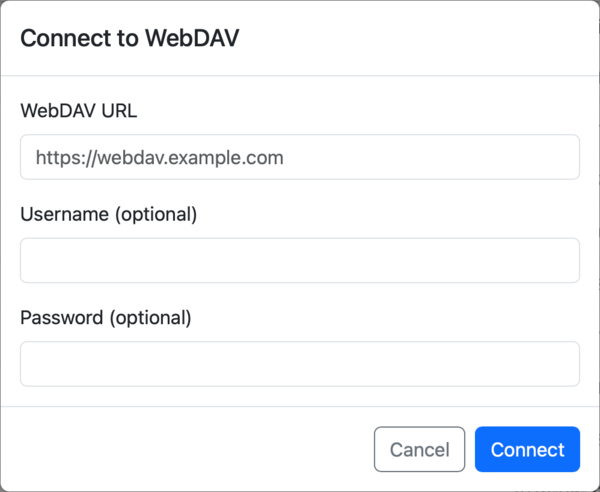

# WebDAV Index

README [English](README.md) | [中文](README_ZH.md)

## What is this

WebDAV-Index is a local-first WebDAV client that browses remote files as a read-only list. It is static and requires no build step: a single HTML file and a few ES modules, with all dependencies loaded from a CDN. It runs entirely in the browser, communicates with the WebDAV server directly, and sends data to no third party.

WebDAV-Index provides browsing only: it lists directories, navigates into subdirectories and opens files, and it does not upload, edit, rename or delete. It opens each file through the browser, which renders `.jpg`, `.txt` and `.mp4` in place and downloads the rest.

## Features

- **Read-only listing**: renders each directory as a table of name, modified time and size
- **Optional auth**: sends HTTP Basic credentials only when the server requires them
- **Saved credentials**: stores credentials in `localStorage` and reuses them after a reload
- **Multiple hosts**: records connected servers and switches between them from the navbar
- **Responsive layout**: adapts to phone, tablet and desktop screen widths

## Download and Install

WebDAV-Index requires no download or installation: open [webdav-index.fantasticmao.cn](https://webdav-index.fantasticmao.cn/) in a browser and it is ready to use.

## Quick Start

WebDAV-Index opens a connection form on first visit. Enter the URL of the WebDAV service, add a username and password if the server requires authentication, then click Connect.

## How it works

WebDAV-Index is built on the following dependencies, all loaded from a CDN as native ES modules:

- [webdav-client](https://github.com/perry-mitchell/webdav-client): lists directories and builds the URLs used to open a file
- [localStorage](https://developer.mozilla.org/en-US/docs/Web/API/Window/localStorage): keeps connected servers and their credentials on the local machine
- [Bootstrap](https://getbootstrap.com/): provides the table, navbar, dialog and responsive layout
- [Alpine.js](https://alpinejs.dev/): binds state and events declaratively, without a build step

## FAQ

When WebDAV-Index reports that the browser blocked the request, the cause is one of the following.

### Why does Connect fail when the same URL works in another client?

WebDAV-Index lists directories with a cross-origin `PROPFIND`, so CORS blocks the request unless the server opts in. Allow `OPTIONS` and `PROPFIND`, match `Access-Control-Allow-Origin` to this origin, and include `Depth` in `Access-Control-Allow-Headers` (`Authorization` when credentials are sent).

### Why is an `http://` WebDAV URL rejected from an `https://` origin?

Mixed Content policy blocks an HTTPS origin from requesting HTTP, except loopback (`127.0.0.1`, `localhost`, `[::1]`) in Chrome and Firefox, Safari may still block loopback. Use **one** of: open this project over `http://`, allow Insecure content in site settings, or serve WebDAV over HTTPS.

### Why does a home NAS, LAN, or loopback URL fail from the live site?

Local Network Access applies when a public origin reaches a private or loopback address, and Chrome may prompt for permission. Allow local network access if the browser asks; the server must still satisfy CORS.

## License

WebDAV-Index is released under the MIT License; see [LICENSE](LICENSE).
